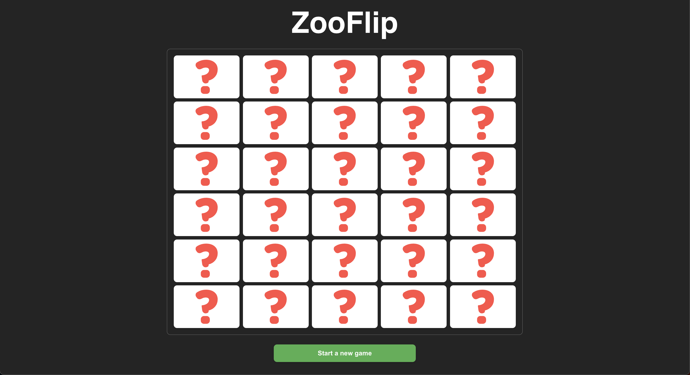

# 🐾 ZooFlip

A memory card game built with **React**, **TypeScript**, and **Vite**



---

## ✨ Features

- 🔁 **Flip & Match** card logic with smooth animations
- 🧠 Tracks flipped cards, matched pairs, and lockouts
- 🧩 Shuffling animation to simulate new game setup
- 🎨 Built with **styled-components** for modular styling
- 🧪 Unit tested with **Jest** and **React Testing Library**
- ✅ Pre-commit hooks via **Husky** + **lint-staged**
- 🚀 GitHub Actions CI for linting, testing, and builds

---

## 📦 Tech Stack

- **React + TypeScript**
- **Vite** for blazing-fast dev builds
- **Styled-components** for scoped styling
- **Jest** for unit tests
- **ESLint + Prettier** for consistent code
- **Husky + lint-staged** for code quality on commit

---

## 🧑‍💻 Getting Started

```bash
# 1. Clone the repo
git clone https://github.com/IonutParaschiv/memory-pair.git
cd memory-pair

# 2. Install dependencies
npm install

# 3. Run locally
npm run dev
```
### 🧪 Tests

- Run with **Jest** and **React Testing Library**
- Triggered on pre-commit and CI

### 🛡 Code Quality

- ESLint with TypeScript & React rules
- Prettier auto-formatting
- Husky + lint-staged for commit safety
- GitHub Actions to lint, test, and build on push